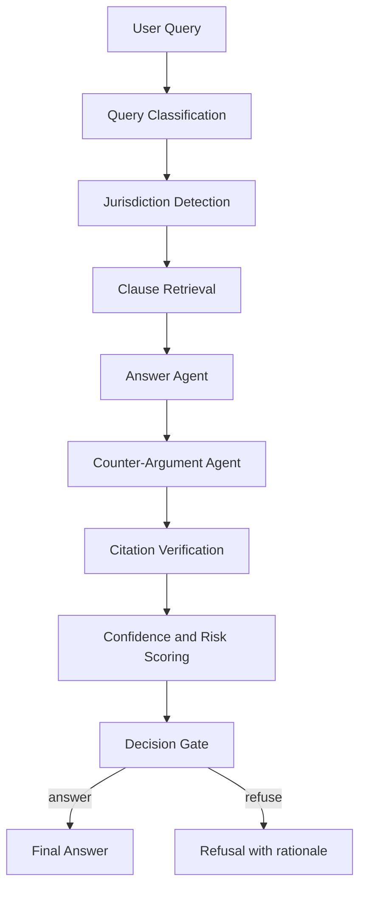

# Veritas AI

Veritas AI is a legal research assistant built with adversarial multi-agent RAG.  
It retrieves relevant contract clauses, generates a grounded answer, challenges that answer with a counter-argument agent, verifies citations, and produces confidence/risk signals before returning a final response.

This repository is currently optimized for a portfolio/demo workflow, while keeping the architecture extensible for future production hardening.

## Product Summary

| Item | Description |
|---|---|
| Product | Veritas AI |
| Tagline | Legal research, verified and challenged |
| Core Pattern | Multi-agent RAG with adversarial validation |
| Primary Model Provider | Groq (configurable to OpenAI/Anthropic) |
| Backend | Python 3.11, FastAPI, LangGraph, LangChain |
| Frontend | Next.js 14 (App Router), Tailwind CSS |
| Retrieval | FAISS + sentence-transformers embeddings |

## System Architecture



## Reasoning Pipeline

| Stage | Purpose | Output |
|---|---|---|
| Query Classification | Determine question type and scope | Structured query intent |
| Jurisdiction Detection | Capture legal context where available | Jurisdiction hint |
| Clause Retrieval | Semantic retrieval from indexed documents | Top-k relevant clauses |
| Answer Agent | Generate grounded legal response | Answer + citations |
| Counter-Argument Agent | Stress-test reasoning for weaknesses | Contradictions/exceptions/ambiguities |
| Citation Verification | Validate quote grounding against source text | Verification status |
| Confidence & Risk Scorer | Aggregate retrieval quality + adversarial signals | Confidence score + risk tier |
| Decision Gate | Apply safety/quality policy | Answer or refusal |

## Repository Layout

```text
LegalAI RAG/
├── backend/
│   ├── main.py
│   ├── requirements.txt
│   ├── src/
│   │   ├── agents/
│   │   ├── api/
│   │   ├── graph/
│   │   ├── ingestion/
│   │   ├── retrieval/
│   │   ├── schemas/
│   │   └── utils/
│   └── test_*.py
├── frontend/
│   ├── app/
│   ├── components/
│   ├── lib/
│   └── package.json
├── data/
├── docs/
└── setup.sh
```

## API Surface

The backend mounts these route groups:

| Route Group | Prefix | Responsibility |
|---|---|---|
| Health | `/api/health` | Service readiness |
| Query | `/api/query` | End-to-end multi-agent legal analysis |
| Documents | `/api/documents` | Upload/list/delete indexed docs |
| Stats | `/api/stats` | Indexed corpus/system metadata |
| Docs UI | `/api/docs` | OpenAPI Swagger interface |

## Frontend Pages

| Page | Path | Purpose |
|---|---|---|
| Landing | `/` | Product overview and capability framing |
| Query | `/query` | Ask legal questions and inspect grounded responses |
| Upload | `/upload` | Upload and annotate legal documents |
| Documents | `/documents` | Manage indexed documents |
| History | `/history` | Review previous query runs |

## Local Setup

### Prerequisites

- Python 3.11
- Node.js 18+ and npm
- A Groq API key

### 1) Backend setup

```bash
cd "LegalAI RAG"
source legalRAG/bin/activate
pip install -r backend/requirements.txt
```

Create `backend/.env` (example values):

```env
GROQ_API_KEY=your_key_here
LLM_PROVIDER=groq
LLM_MODEL=llama-3.1-8b-instant
LLM_TEMPERATURE=0.0
```

Start backend:

```bash
cd backend
python main.py
```

Backend will be available at:
- `http://localhost:8000/api/health`
- `http://localhost:8000/api/docs`

### 2) Frontend setup

```bash
cd "../frontend"
npm install
```

Create `frontend/.env.local`:

```env
NEXT_PUBLIC_API_URL=http://localhost:8000/api
```

Start frontend:

```bash
npm run dev
```

Frontend will be available at `http://localhost:3000`.

## Deployment (Lowest-Cost Portfolio Setup)

| Layer | Platform | Cost Profile |
|---|---|---|
| Frontend | Vercel Hobby | Free |
| Backend | Render Free Web Service | Free (cold starts) |

Deployment order:
1. Deploy backend (`backend` root) and set runtime env vars.
2. Deploy frontend (`frontend` root) and set `NEXT_PUBLIC_API_URL` to backend URL.
3. Smoke test upload and query flow on deployed URLs.

## Sanity Checks Before Sharing

- Frontend production build passes (`npm run build` in `frontend`)
- Backend starts successfully and serves `/api/health`
- Upload accepts only supported document types
- Query returns answer + citations + confidence/risk metadata
- Counter-argument and citation verification render without schema errors
- Legal disclaimer is visible in UI

## Known Limitations (Current Scope)

- Designed for portfolio/demo usage, not hardened for regulated production environments.
- Current API CORS defaults are local-development oriented.
- Vector index persistence is file-based FAISS for simplicity.
- Model outputs are constrained/validated, but LLM variability still applies.

## Disclaimer

Veritas AI provides AI-assisted legal research outputs and is not legal advice.  
Always consult a licensed attorney before acting on legal interpretations.

